# Lab 7 Web : PHP Dasar

<table border="2" cellpading="10">
  <tr>
    <td><b>Nama</b></td>
    <td>Fahmi Eko Putro Santoso</td>
  </tr>
  <tr>
    <td><b>NIM</b></td>
    <td>312010046</td>
  </tr>
  <tr>
    <td><b>Kelas</b></td>
    <td>TI.20.A1</td>
  </tr>
  <tr>
    <td><b>MataKuliah</b></td>
    <td>Pemrograman Web</td>
  </tr>
</table>

# <b>Praktikum</b>

## <b>1. Membuka Visual Code & Install XAMPP </b>
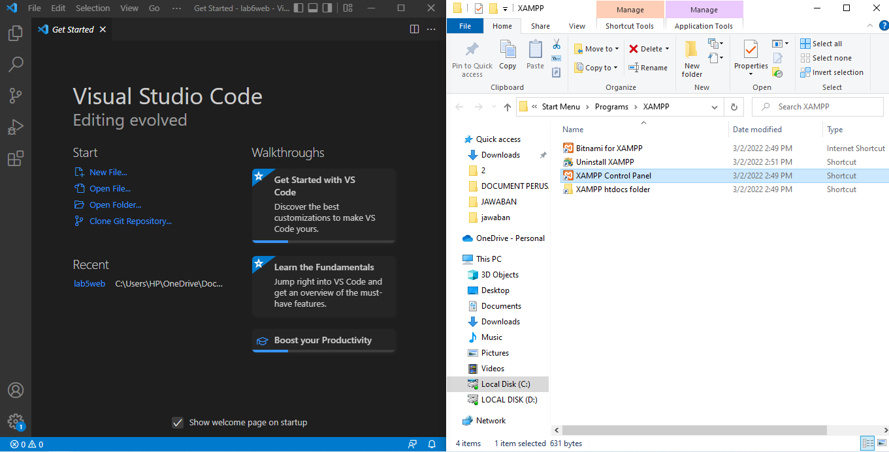

## <b>2. PHP Dasar</b>
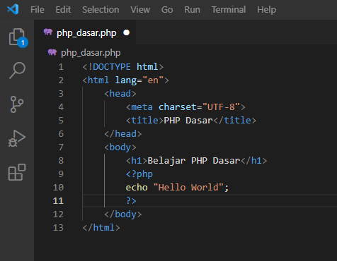

## <b>3. Variable PHP</b>
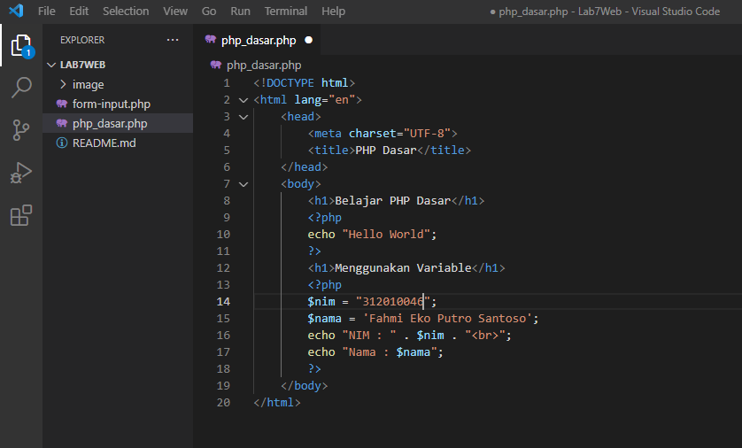

## <b>4. Predefine Variable $_GET</b>
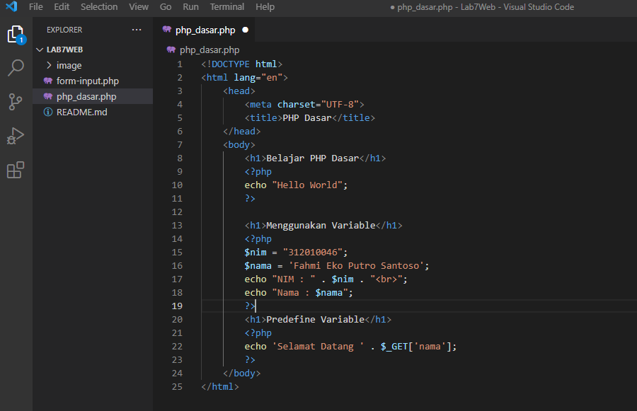

## <b>5. Form Input</b>
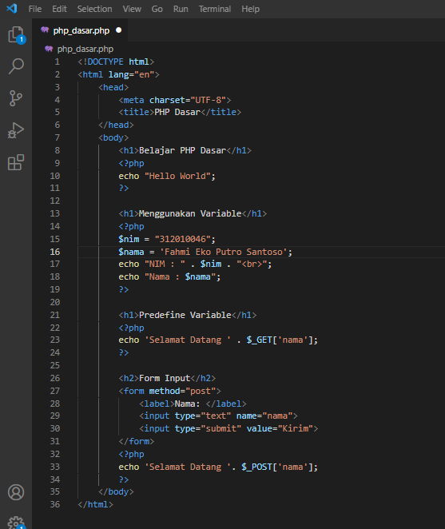

## <b>6. Operator</b>
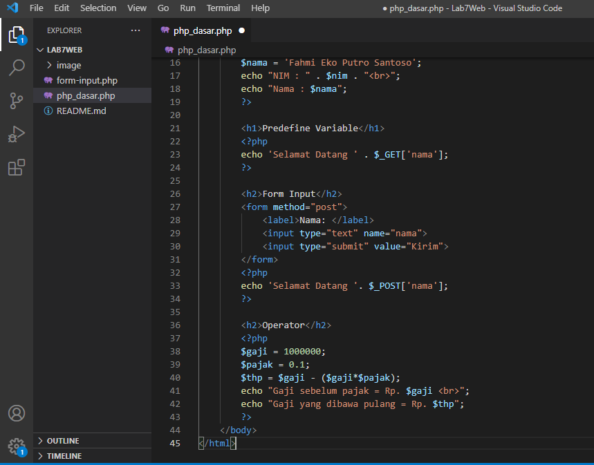

## <b>7. Klausul If</b>
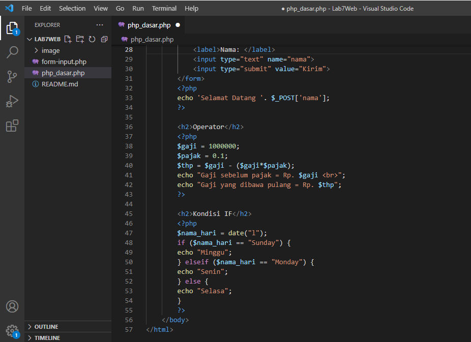

## <b>8. Switch</b>
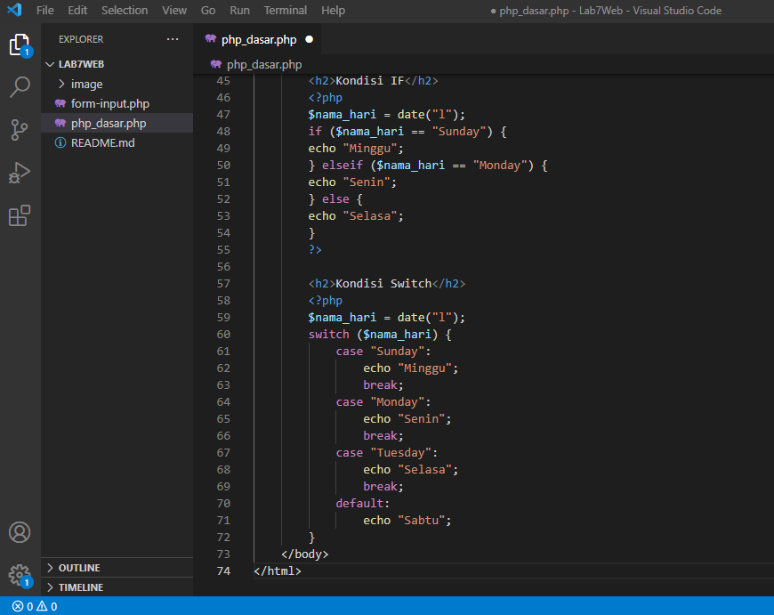

## <b>9. Perulangan For</b>
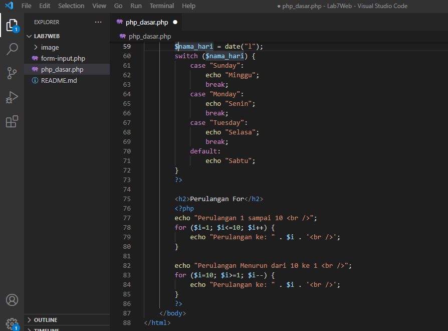

## <b>10. Perulangan While</b>
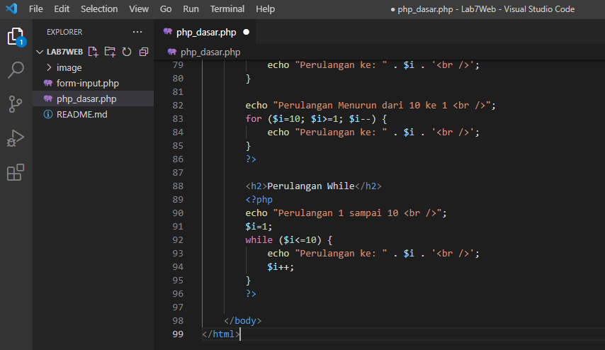

## <b>11. Perulangan Dowhile</b>
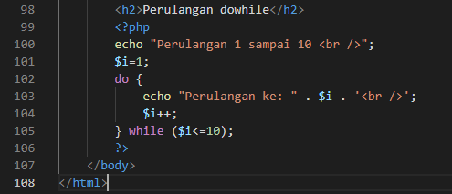

# TUGAS
<b>1. Buatlah program PHP sederhana dengan menggunakan form input yang menampilkan nama, tanggal lahir dan pekerjaan. Kemudian tampilkan outputnya dengan menghitung umur berdasarkan inputan tanggal lahir. Dan pilihan pekerjaan dengan gaji yang  berbeda-beda sesuai pilihan pekerjaan.</b> 
# Jawaban:  

- Kode Awal, tanpa php.
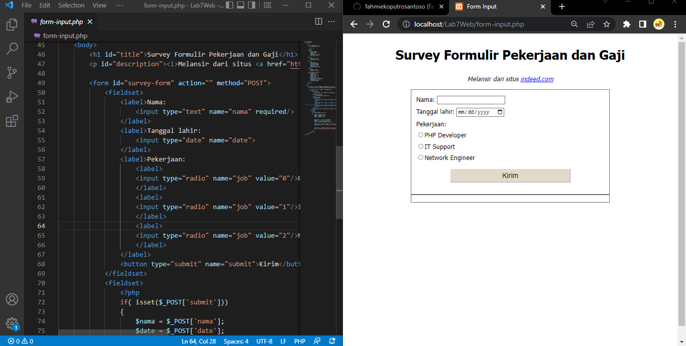  

- Kemudian tambahkan kode PHP, dan jalankan.

- Setelah memilih PHP Developer
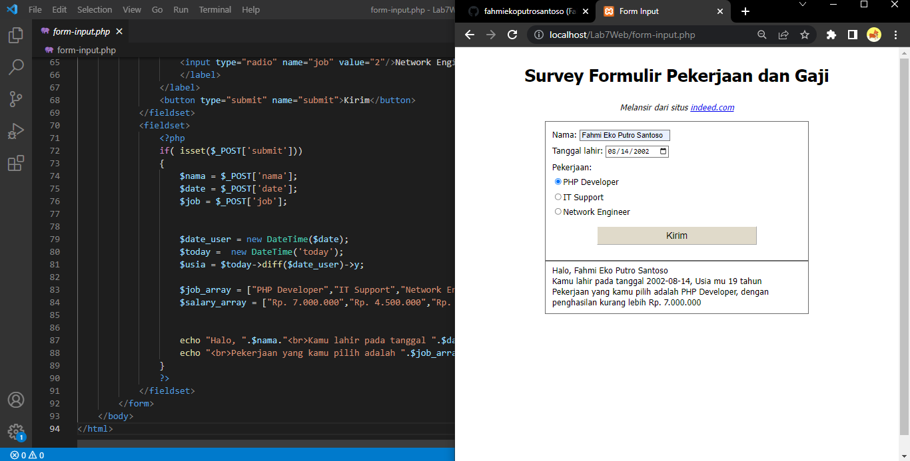  

- Setelah memilih IT Support
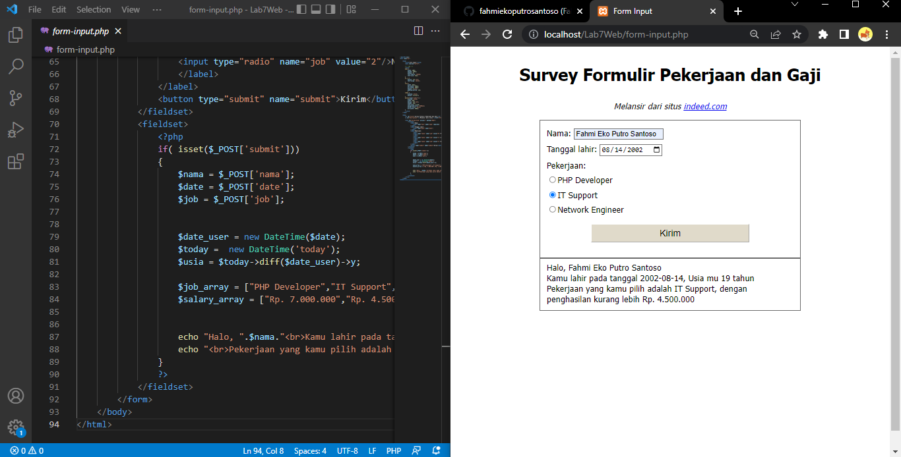  

- Setelah memilih Network Engineer
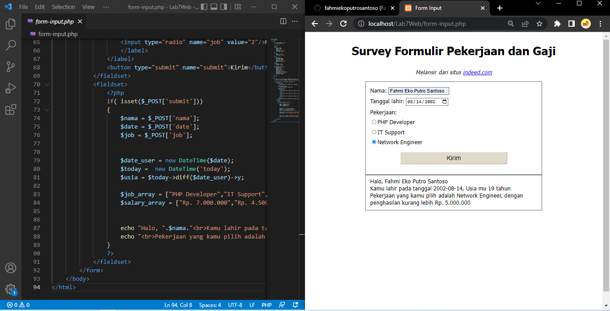  

- Method ``POST`` tidak akan menampilkan nilai di url, lebih aman dari ``GET``.
- Jika belum menekan ``Kirim``, perubahan takan terjadi.
- Tiap input dan pilihan menyimpan nilai, di file program itu sendiri. <i>peletakan di ``<form action="" ..></i>.
- Nama diambil dari atribut ``name=nama`` pada kode html.
- Penentuan usia, dimulai dengan penanggalan saat ini ``$today`` dikurangi dengan tanggal lahir pengguna ``$date_user``. Kemudian ambil tahunnya saja. ``->y``
- Versi awal ini dibuat pada, ``17-05-2022``. Sehingga jika dihitung dengan tanggal lahir pada gambar tersebut, belum genap 20.
- Pilihan pekerjaan dengan menggunakan array.
    - Array pertama berisi profesi ``$job_array``
    - Array kedua berisi gaji ``$salary_array``
- Kemudian, pengguna akan memilih. Dimulai dari angka <b>0, 1, dan 2.</b>
- Terakhir, tampilkan hasil seluruh proses dengan ``echo``
